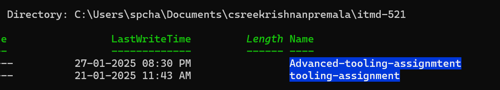

# Tooling Assignment Advanced Template

This is the assigned template for the `tooling-assignment-advanced-instructions` assignment. You will complete this document by adding the required screenshots.

## Hostname Change


## WebServer Install

Screenshot from the host OS of http://192.168.33.10 or whichever private IP you assign to your Vagrant Box


## MariaDB Version

Execute command: `mysql -V`


## Java Version

Execute command: `java -version`


## Spark Versions

Execute command: `pyspark` and `spark-shell` and take screenshots of each.


## R Version

Execute command: `R -v`


## Python Version

Execute command: `python3 -V`


## Result of Cloning Your Private Repository

No need to show the clone action -- just the results of the `ls` command of the cloned directories content




## Output of vagrant box list command

After completing this tutorial take a screenshot of the output of the command ```vagrant box list```


## Deliverable

In the document, tooling-assignment-advanced-template.md, provide the required screenshots. Push a copy of this Markdown file in the private GitHub repo provided, under the itmd-521 folder and make an additional sub-folder named: **tooling-assignment-advanced**.  Submit the URL to your deliverable to Canvas.
