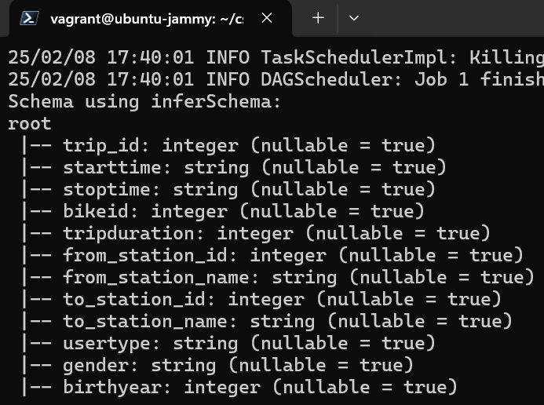
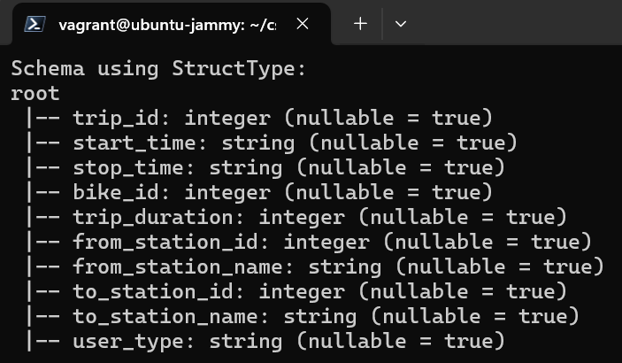
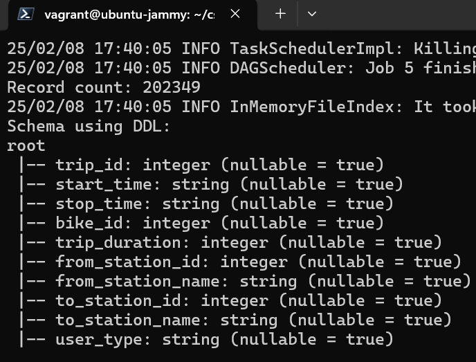

# Module-04 Lab

## Objectives

* Create and demonstrate the creation of Spark Schemas for Python and Scala
* Create and build running Spark Applications
* Create and build an application that will read arbitrary input

## Outcomes

At the conclusion of this lab you will have built Spark applications in Python and Scala and demonstrated the three methods for assigning schemas to arbitrary data.

## Assignment Setup

- Using the file `Divvy_Trips_2015-Q1.zip`, extract the CSV file provided
- In your local repo add the following data types to the `.gitignore` file
  - `*.csv`
  - `*.txt`
  - `*.json`
  - `target/` to ignore Jar file artifacts
- You can extract a compressed Zip file using the command: `unzip Divvy_Trips_2015-Q1.zip`
  - May have to use `sudo apt-get install unzip` if application not found
- Complete the assignment and push this Readme.md template to the remote repo.

## Assignment Details

- In your local Git Repo, create a folder named **labs** under the `itmd-521` folder and create a sub-folder **module-04** and place this Readme.md template in that directory along with the required pieces of code
  - You will create one program
    - Python: module-04.py
  - Create three data frames reading data from the extracted `Divvy_Trips_2015-Q1.csv` 
    - Do not hardcode the path to the data file
      - Follow the example in the MnMCount to dynamically declare the location from the command line
    - First **infer the schema** and read the csv file
    - Second programmatically use **StructFields** to create and attach a schema and read the csv file
    - Third attach a schema via a DDL and read the csv file
- After each read operation include the function `printSchema()`
  - [printSchema - Python](https://spark.apache.org/docs/latest/api/python/reference/pyspark.sql/api/pyspark.sql.DataFrame.printSchema.html?highlight=printschema "pyspark printschema web page")
- Also use the `.count()` function to display the number of records in each DataFrame
  - [.count - Python](https://spark.apache.org/docs/latest/api/python/reference/pyspark.sql/api/pyspark.sql.functions.count.html?highlight=count#pyspark.sql.functions.count "webpage to Scala API")

## Screen Shots

Add the required screenshots here:

### Screenshot of the printSchema inferred in Python

### Screenshot of the printSchema programmatically in Python

### Screenshot of the printSchema via DDL in Python

### Deliverable

Using this template, under the itmd-521 directory in your local repository, create a sub-directory named labs. Under that create another subdirectory named module-03 and place this Readme.md file in that directory along with a folder for images. `itmd-521` > `labs` > `module-04`

Due at the **Start of class** February 13th 3:15pm
